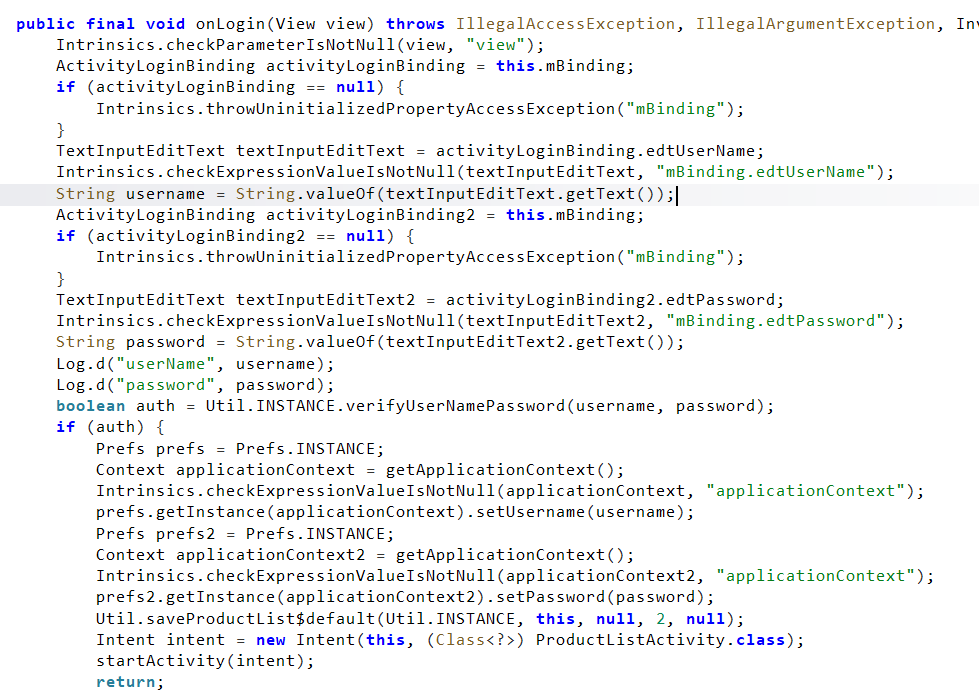
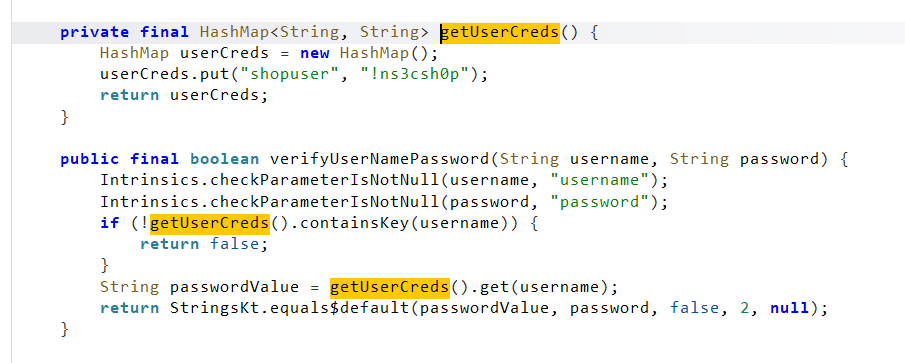

# InsecureShop Android 앱 보안 분석

## 1. 프로젝트 개요

`InsecureShop`은 학습용으로 제작된 취약한 Android 애플리케이션으로, 로그인 로직, WebView 처리, Android 컴포넌트 노출, 네트워크 통신 등 다양한 보안 취약점을 포함하고 있다. 본 저장소는 `InsecureShop`을 대상으로 수행한 Android 앱 보안 분석 결과를 정리한 포트폴리오 프로젝트다.

이번 분석의 목적은 단순한 문제 풀이에 그치지 않고, Android 애플리케이션에서 자주 발생하는 취약점 유형을 실제 코드와 동작 기준으로 식별하고 재현 가능한 형태로 정리하는 데 있다.

## 2. 분석 대상 및 환경

| 항목 | 내용 |
|---|---|
| 분석 대상 | `InsecureShop` |
| 플랫폼 | Android |
| 실행 환경 | `Nox` |
| 분석 도구 | `adb`, `jadx` |
| 추가 도구 | `Burp Suite`, `Frida` |
| 분석 범위 | 로그인, WebView/Deeplink, Android Components, Content Provider, 네트워크 통신 |

## 3. 분석 방법

분석은 정적 분석과 동적 분석을 병행하는 방식으로 진행하였다.

- 정적 분석: `jadx`를 이용해 `AndroidManifest.xml`, Activity, Utility 클래스, WebView 처리 로직, Provider 설정, SSL 관련 코드를 확인하였다.
- 동적 분석: `adb`를 이용해 앱 설치 및 실행, 컴포넌트 호출, `logcat` 확인을 수행하였다.
- 네트워크 분석: `Burp Suite`를 통해 프록시 기반 트래픽 확인 및 SSL 검증 우회 여부를 검토하였다.
- 런타임 분석: 필요한 경우 `Frida`를 이용해 메서드 동작과 우회 가능성을 확인하였다.

## 4. 취약점 분석

### 4.1 Hardcoded Credentials

상세 보고서: [01-hardcoded-credentials.md](./findings/01-hardcoded-credentials.md)

#### 개요

로그인 기능을 분석한 결과, 사용자 인증에 사용되는 계정 정보가 애플리케이션 내부 코드에 하드코딩되어 있음을 확인하였다. 공격자는 APK를 디컴파일해 자격증명을 식별할 수 있으며, 이를 이용해 정상 로그인 절차를 그대로 통과할 수 있다.

#### 분석 방법

로그인 화면에서 임의의 값을 입력해 동작을 먼저 확인한 뒤, `jadx`를 이용해 로그인 처리 로직을 추적하였다. `LoginActivity`의 `onLogin()` 메서드에서 입력된 아이디와 비밀번호가 인증 함수로 전달되는 흐름을 확인하고, 이후 실제 인증 로직이 구현된 메서드까지 따라가며 계정 검증 방식을 분석하였다.

#### 발견 근거

`LoginActivity.onLogin()`에서는 사용자가 입력한 `username`, `password`를 `Util.verifyUserNamePassword(username, password)`로 전달한다. 이후 인증 로직을 추적한 결과, `getUserCreds()` 메서드에서 계정 정보가 `HashMap` 형태로 직접 선언되어 있었으며, `shopuser`와 `!ns3csh0p`가 하드코딩된 자격증명으로 사용되고 있음을 확인하였다.

이는 인증에 필요한 민감 정보가 클라이언트 애플리케이션 내부에 포함되어 있다는 의미이며, 공격자는 APK 확보만으로 자격증명 추출이 가능하다.

#### 재현 과정

먼저 로그인 화면에서 임의의 값을 입력했을 때 `Invalid username and password` 메시지가 출력되는 것을 확인하였다. 이후 `jadx`에서 로그인 로직을 분석하여 하드코딩된 계정 정보 `shopuser / !ns3csh0p`를 식별하였다. 식별한 계정 정보를 실제 로그인 화면에 입력한 결과, `ProductListActivity`로 이동하며 로그인이 성공하는 것을 확인하였다.

이를 통해 앱 내부에 포함된 자격증명만으로 인증 절차가 우회 가능함을 검증하였다.

#### 영향도

하드코딩된 자격증명은 디컴파일만으로 쉽게 추출될 수 있으므로, 공격자가 정상 사용자 권한을 획득하는 데 직접 악용될 수 있다. 특히 인증 검증이 클라이언트 내부 로직에 의존하는 경우, 앱을 분석한 누구나 동일한 방식으로 로그인 기능을 우회할 수 있다.

#### 대응 방안

- 인증에 사용되는 계정 정보나 비밀값을 애플리케이션 내부에 하드코딩하지 않아야 한다.
- 자격증명 검증은 서버 측에서 수행하고, 클라이언트는 결과만 처리하도록 설계해야 한다.
- 난독화는 분석 난도를 높이는 보조 수단일 뿐, 하드코딩 문제의 근본적인 해결책이 될 수 없다.

#### 취약점 테스트

## 5. 결론

이번 분석에서는 `jadx`를 이용해 로그인 처리 흐름을 추적하고, `getUserCreds()` 메서드에 하드코딩된 자격증명을 식별한 뒤 실제 로그인 성공까지 검증하였다. 이를 통해 Android 애플리케이션에서 하드코딩된 인증정보가 얼마나 쉽게 식별되고 악용될 수 있는지 확인할 수 있었다.

본 저장소는 `InsecureShop`을 대상으로 진행한 모바일 앱 보안 분석 포트폴리오이며, 각 취약점은 독립된 보고서 형식으로 순차적으로 정리하고 있다.
