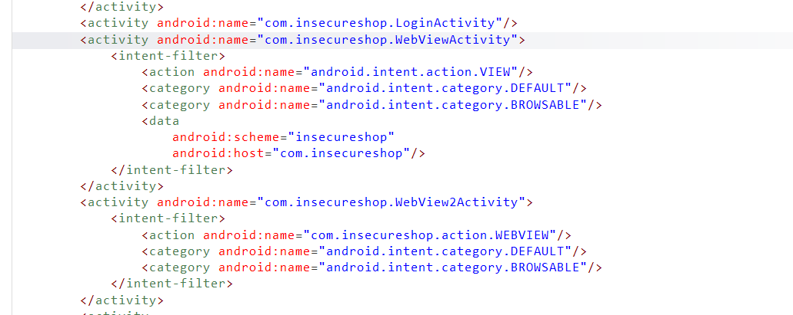

# InsecureShop - Insufficient URL Validation

## 1. 개요

`InsecureShop`의 `WebViewActivity`를 분석한 결과, deeplink의 `/web` 경로에서는 외부에서 전달된 `url` 파라미터가 충분한 검증 없이 그대로 `webview.loadUrl()`에 전달되는 구조를 확인하였다. 이로 인해 공격자는 임의의 외부 URL을 앱 내부 WebView에 직접 로드할 수 있었다.

## 2. 취약점 요약

| 항목 | 내용 |
|---|---|
| 취약점명 | `Insufficient URL Validation` |
| 취약점 유형 | Deeplink 기반 임의 URL 로드 |
| 영향 | 앱 내부 WebView에서 임의 외부 페이지 로드 가능 |
| 분석 도구 | `jadx`, `nox_adb`, `Nox` |
| 핵심 컴포넌트 | `WebViewActivity` |

## 3. 분석 환경

| 항목 | 내용 |
|---|---|
| 대상 앱 | `InsecureShop` |
| 실행 환경 | `Nox` |
| 운영체제 | Android |
| 정적 분석 | `jadx` |
| 동적 검증 | `nox_adb shell am start` |

## 4. 분석 방법

이번 항목은 deeplink 입력이 WebView까지 도달하는 흐름을 기준으로 다음 순서로 분석하였다.

1. `AndroidManifest.xml`에서 `WebViewActivity`가 외부 URI를 처리하는 deeplink 진입점인지 확인하였다.
2. `WebViewActivity` 내부에서 `intent.getData()`와 `url` 파라미터가 어떻게 처리되는지 추적하였다.
3. `/web` 경로에서 별도 검증 없이 `loadUrl()`까지 도달하는지 확인하였다.
4. `nox_adb shell am start` 명령으로 실제 deeplink를 호출해 외부 URL 로딩 여부를 검증하였다.

## 5. 상세 분석

### 5.1 Deeplink 진입점 확인

`AndroidManifest.xml` 분석 결과, `WebViewActivity`는 `android.intent.action.VIEW`와 `android.intent.category.BROWSABLE`를 사용하는 `intent-filter`를 통해 `insecureshop://com.insecureshop` 형태의 URI를 처리하고 있었다.

즉 이 Activity는 외부 deeplink 입력을 직접 받는 진입점이며, 전달된 URI 값이 이후 WebView 로직에 영향을 준다는 점에서 우선 분석 대상이 되었다.

### 5.2 `/web` 경로에서의 검증 부족

`WebViewActivity`는 `intent.getData()`로 받은 URI를 기준으로 `/web`와 `/webview` 경로를 분기한다. 이 중 `/web` 경로에서는 `url` 파라미터를 그대로 꺼내 `data` 변수에 대입하고, 이후 별도의 allowlist 검증 없이 `webview.loadUrl(data)`를 호출한다.

즉 아래와 같은 deeplink가 전달되면:

```text
insecureshop://com.insecureshop/web?url=https://naver.com
```

앱은 해당 URL이 허용된 도메인인지, 신뢰 가능한 값인지 확인하지 않은 채 그대로 WebView에 로드한다. 입력 검증이 부족한 상태에서 외부 URL이 곧바로 위험 동작으로 이어지므로 `Insufficient URL Validation`에 해당한다.

### 5.3 동적 검증

실제 동작은 아래 명령으로 검증하였다.

```powershell
nox_adb shell am start -W -a android.intent.action.VIEW -d "insecureshop://com.insecureshop/web?url=https%3A%2F%2Fnaver.com" com.insecureshop
```

실행 결과 `WebViewActivity`가 열리며 `naver.com`이 앱 내부 WebView에 그대로 로드되었다. 이를 통해 `/web` 경로에서는 외부에서 전달된 임의 URL이 충분한 검증 없이 처리됨을 확인하였다.

## 6. 영향도

이 구조를 악용하면 공격자는 앱 내부 화면처럼 보이는 WebView에 임의의 외부 페이지를 로드할 수 있다. 그 결과 사용자는 정상 앱 콘텐츠로 오인할 수 있으며, 피싱 페이지 노출, 악성 웹 콘텐츠 실행, 추가 WebView 취약점과의 결합 위험이 발생할 수 있다.

## 7. 대응 방안

- deeplink로 전달된 외부 URL을 그대로 `loadUrl()`에 전달하지 않아야 한다.
- 허용 가능한 scheme, host, path를 명시적으로 제한하는 allowlist 기반 검증을 적용해야 한다.
- WebView에 로드할 URL은 `Uri.parse()`로 구조적으로 검증한 뒤 안전한 값만 사용해야 한다.

## 8. 결론

이번 분석에서는 `WebViewActivity`의 `/web` 분기에서 외부 입력 URL이 별도 검증 없이 `webview.loadUrl()`로 전달됨을 확인하였다. 동적 검증 결과 `naver.com`이 실제로 앱 내부 WebView에 로드되어 `Insufficient URL Validation` 취약점이 성립함을 확인하였다.

## 9. 취약점 테스트

### 1. Deeplink 진입점 확인



`WebViewActivity`는 `VIEW` 및 `BROWSABLE` 인텐트 필터와 `scheme`, `host`를 함께 선언하고 있어 외부 URI 기반 deeplink 진입점으로 동작함을 확인할 수 있다.

### 2. `/web` 경로 처리 코드 확인


`WebViewActivity` 내부에서는 `intent.getData()`로 전달된 URI를 기준으로 경로를 분기한다. `/web` 분기에서는 `url` 파라미터를 대입한 뒤 별도 검증 없이 `webview.loadUrl(data)`가 호출되는 구조를 확인할 수 있다.

### 3. `/web` 분기로 임의 URL 로드 확인

사용 명령:

```powershell
nox_adb shell am start -W -a android.intent.action.VIEW -d "insecureshop://com.insecureshop/web?url=https%3A%2F%2Fnaver.com" com.insecureshop
```


실행 결과 `naver.com`이 앱 내부 WebView에 그대로 로드되었다. 이를 통해 `/web` 경로에서는 임의 URL 로드가 가능함을 검증하였다.
