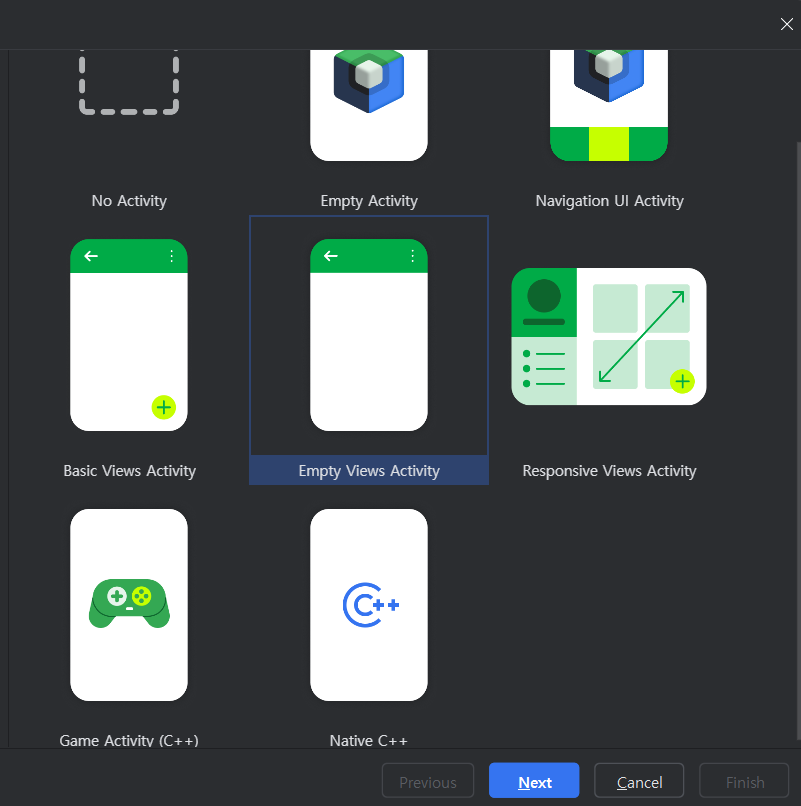
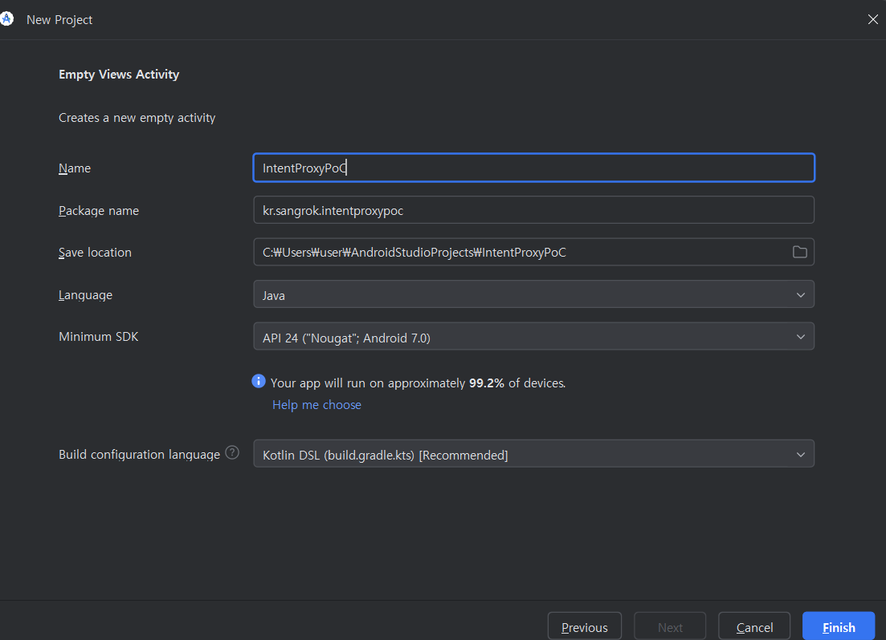
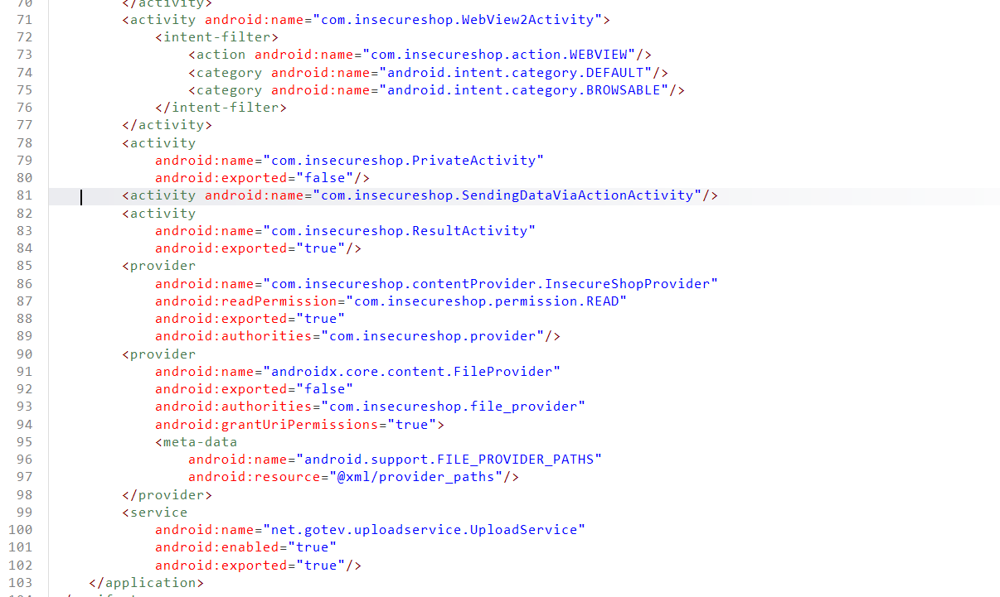
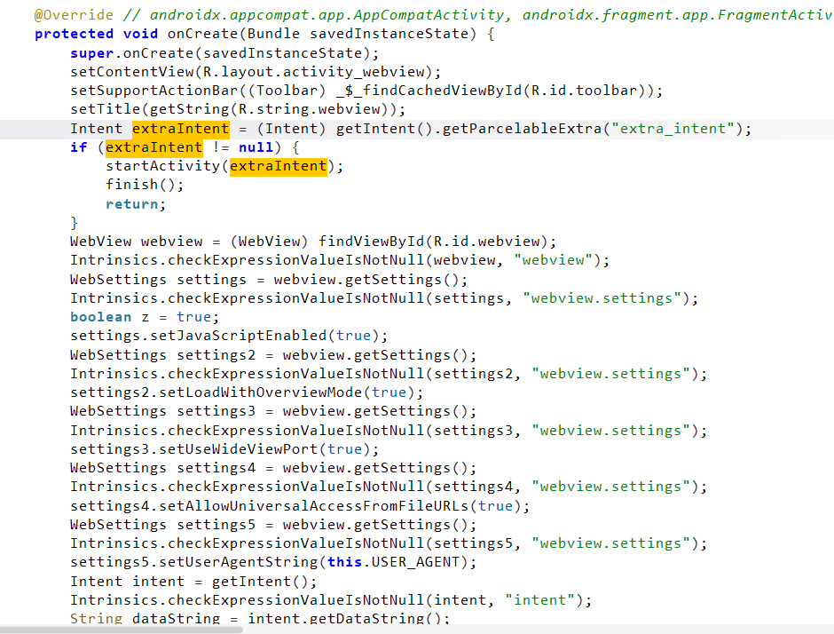
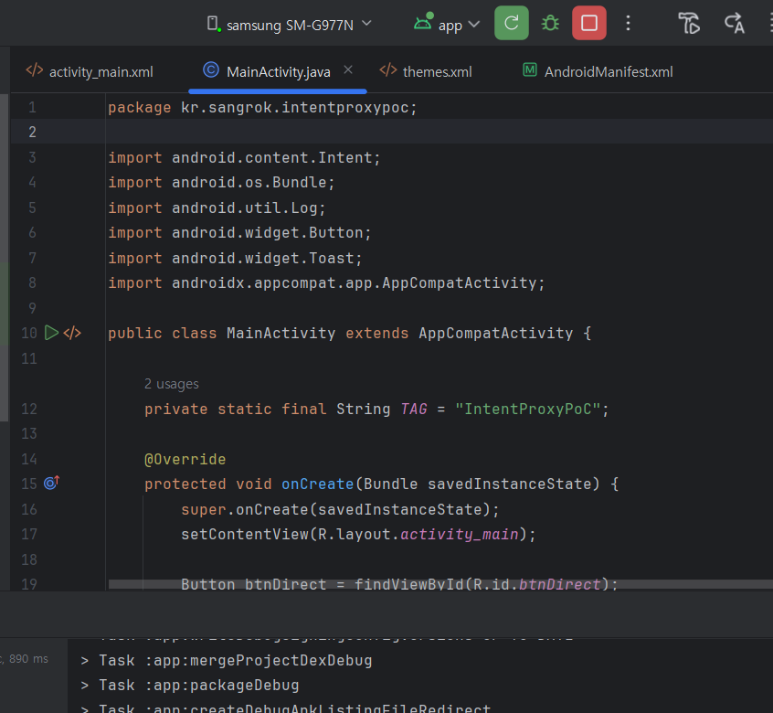
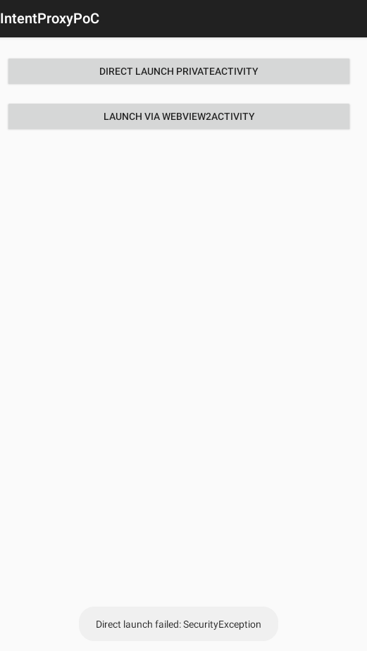
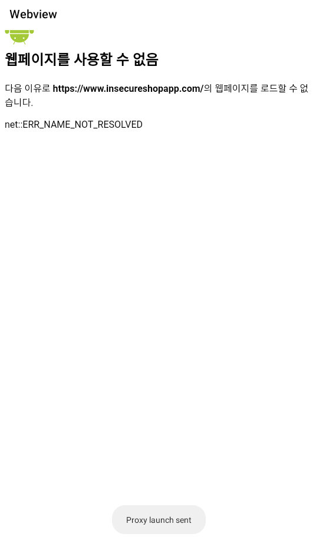
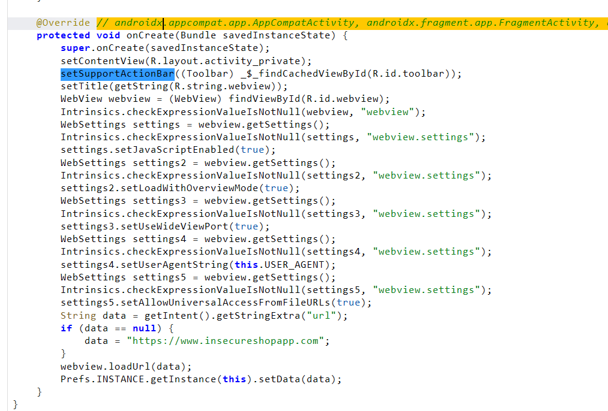

# InsecureShop - Access to Protected Components

## 1. 개요

`InsecureShop`의 `WebView2Activity`를 분석한 결과, 외부에서 전달된 embedded Intent를 검증 없이 실행하는 구조를 확인하였다. 이로 인해 원래 외부 앱이 직접 접근할 수 없는 `PrivateActivity`와 같은 보호된 컴포넌트가 exported Activity를 통해 우회 호출될 수 있었다.

이번 항목은 단순히 Manifest 설정만 확인하는 데 그치지 않고, 일반 서드파티 앱 역할을 하는 PoC 애플리케이션을 직접 만들어 `Direct Launch`와 `Proxy Launch`의 차이를 비교하는 방식으로 검증하였다.

## 2. 취약점 요약

| 항목 | 내용 |
|---|---|
| 취약점명 | `Access to Protected Components` |
| 취약점 유형 | Embedded Intent를 이용한 protected component 우회 접근 |
| 영향 | 외부 앱이 원래 직접 접근할 수 없는 내부 Activity 실행 가능 |
| 분석 도구 | `jadx`, `Android Studio`, `Nox` |
| 핵심 컴포넌트 | `WebView2Activity`, `PrivateActivity` |

## 3. 분석 환경

| 항목 | 내용 |
|---|---|
| 대상 앱 | `InsecureShop` |
| 실행 환경 | `Nox` |
| 운영체제 | Android |
| 정적 분석 | `jadx` |
| 동적 검증 | PoC 앱, `nox_adb` |

## 4. 분석 방법

이번 항목은 Android 컴포넌트 보호 경계를 기준으로 다음 순서로 분석하였다.

1. `AndroidManifest.xml`에서 외부 접근이 제한된 Activity와 외부 호출 가능한 Activity를 구분하였다.
2. `PrivateActivity`가 `exported=false`로 선언된 보호 대상 컴포넌트임을 확인하였다.
3. `WebView2Activity`에서 외부 입력을 통해 전달된 `extra_intent`를 어떻게 처리하는지 코드 흐름을 추적하였다.
4. Android Studio에서 일반 서드파티 앱 역할의 PoC 앱을 생성하고, `PrivateActivity` 직접 실행과 `WebView2Activity`를 통한 우회 실행을 비교하였다.
5. 마지막으로 `PrivateActivity` 내부 코드를 확인하여 우회 실행 후 나타난 결과 화면을 해석하였다.

## 5. 상세 분석

### 5.1 핵심 개념 정리

이번 항목을 이해하기 위해서는 `Activity`, `Intent`, `exported` 세 가지 개념을 먼저 정리할 필요가 있다.

- `Activity`: 안드로이드 앱의 화면 단위 컴포넌트다. 사용자는 화면으로 보지만, 보안 관점에서는 외부 앱이 호출할 수 있는 실행 대상이 된다.
- `Intent`: 안드로이드에서 컴포넌트를 실행하거나 데이터를 전달할 때 사용하는 객체다. 이번 항목에서는 `WebView2Activity`를 실행하는 바깥 Intent 안에, 다시 `PrivateActivity`를 가리키는 내부 Intent가 담겨 전달되었다.
- `exported`: 해당 컴포넌트가 외부 앱에 공개되는지 여부를 나타낸다. `exported=false`는 일반 외부 앱이 직접 실행하면 안 된다는 뜻이고, `exported=true`이거나 `intent-filter`가 있는 컴포넌트는 외부 입력을 처리할 가능성이 높다.

이번 이슈는 외부에서 직접 접근할 수 없는 Activity가 존재하고, 다른 exported Activity가 외부에서 전달된 Intent를 검증 없이 대신 실행해주는 구조에서 발생한다. 즉 핵심은 "보호된 Activity가 있는가"와 "그 Activity를 대신 실행해주는 중간 전달자가 있는가"를 함께 보는 것이다.

### 5.2 보호 대상 컴포넌트 식별

Manifest 분석 결과, `PrivateActivity`는 아래와 같이 `android:exported="false"`로 선언되어 있었다.

```xml
<activity
    android:name="com.insecureshop.PrivateActivity"
    android:exported="false"/>
```

이는 일반 외부 앱이 `PrivateActivity`를 직접 호출해서는 안 된다는 의미다. 따라서 이번 항목에서 `PrivateActivity`는 접근 보호가 적용되어야 하는 protected component로 판단하였다.

### 5.3 외부 진입점 식별

반면 `WebView2Activity`는 아래와 같이 custom action을 처리하는 `intent-filter`를 가지고 있었다.

```xml
<activity android:name="com.insecureshop.WebView2Activity">
    <intent-filter>
        <action android:name="com.insecureshop.action.WEBVIEW"/>
        <category android:name="android.intent.category.DEFAULT"/>
        <category android:name="android.intent.category.BROWSABLE"/>
    </intent-filter>
</activity>
```

이 구성은 `WebView2Activity`가 외부 Intent를 받아 동작할 수 있는 진입점이라는 의미다. 따라서 이번 분석에서는 `PrivateActivity`를 직접 호출하는 대신, `WebView2Activity`가 중간 전달자 역할을 할 수 있는지 여부를 중점적으로 확인하였다.

### 5.4 embedded Intent의 검증 없는 실행

`WebView2Activity` 코드를 확인한 결과, Activity 시작 직후 아래와 같은 로직이 존재하였다.

```java
Intent extraIntent = (Intent) getIntent().getParcelableExtra("extra_intent");
if (extraIntent != null) {
    startActivity(extraIntent);
    finish();
    return;
}
```

이 코드는 외부에서 전달된 `extra_intent` 값을 `Parcelable Intent`로 꺼낸 뒤, 별도의 대상 검증이나 허용 컴포넌트 확인 없이 그대로 `startActivity()`로 실행한다. 즉 `WebView2Activity`는 외부 입력을 받아 다른 Activity를 대신 실행해주는 proxy 역할을 하게 된다.

문제는 이 구조에서 공격자가 `extra_intent` 안에 `PrivateActivity`를 가리키는 Intent를 넣을 수 있다는 점이다. 그 경우 외부 앱은 원래 직접 접근할 수 없는 `PrivateActivity`를 `WebView2Activity`를 경유해 우회 호출할 수 있다.

### 5.5 왜 PoC 앱이 필요했는가

이 취약점은 `extra_intent`가 단순 문자열이 아니라 `Parcelable Intent`라는 점이 핵심이다. 따라서 일반적인 `adb shell am start` 명령만으로는 nested Intent를 정확히 전달하기 어렵고, 일반 서드파티 앱 관점의 재현도 불완전하다.

또한 `adb shell`에서의 컴포넌트 호출은 shell 권한으로 동작하므로, `exported=false` 컴포넌트에 대한 실제 외부 앱 접근 가능 여부를 검증하는 방식으로는 적절하지 않았다. 그래서 이번 항목은 일반 앱 역할을 수행하는 PoC 애플리케이션을 별도로 만들어 검증하였다.

### 5.6 Android Studio 기반 PoC 앱 제작

이번 항목은 `extra_intent`가 `Parcelable Intent`이기 때문에, 문자열 extra 위주의 `adb am start`만으로는 일반 외부 앱 시나리오를 정확히 재현하기 어려웠다. 따라서 Android Studio에서 `Empty Views Activity` 템플릿을 이용해 `IntentProxyPoC`라는 이름의 최소 PoC 앱을 생성하였다.

PoC 앱의 목적은 단순하다.

- `PrivateActivity`를 직접 실행했을 때 차단되는지 확인
- `WebView2Activity`를 경유해 `extra_intent`를 전달했을 때 우회 실행되는지 확인

PoC 앱은 `MainActivity` 하나와 버튼 두 개만으로 구성하였다.

- `DIRECT LAUNCH PRIVATEACTIVITY`
- `LAUNCH VIA WEBVIEW2ACTIVITY`

핵심 코드는 아래와 같다.

```java
public class MainActivity extends AppCompatActivity {

    private static final String TAG = "IntentProxyPoC";

    @Override
    protected void onCreate(Bundle savedInstanceState) {
        super.onCreate(savedInstanceState);
        setContentView(R.layout.activity_main);

        Button btnDirect = findViewById(R.id.btnDirect);
        Button btnProxy = findViewById(R.id.btnProxy);

        btnDirect.setOnClickListener(v -> directLaunch());
        btnProxy.setOnClickListener(v -> proxyLaunch());
    }

    private void directLaunch() {
        try {
            Intent intent = new Intent();
            intent.setClassName("com.insecureshop", "com.insecureshop.PrivateActivity");
            startActivity(intent);
        } catch (Exception e) {
            Log.e(TAG, "Direct launch failed", e);
        }
    }

    private void proxyLaunch() {
        try {
            Intent inner = new Intent();
            inner.setClassName("com.insecureshop", "com.insecureshop.PrivateActivity");

            Intent outer = new Intent();
            outer.setClassName("com.insecureshop", "com.insecureshop.WebView2Activity");
            outer.putExtra("extra_intent", inner);

            startActivity(outer);
        } catch (Exception e) {
            Log.e(TAG, "Proxy launch failed", e);
        }
    }
}
```

이 코드는 일반 앱 입장에서 직접 실행과 proxy 실행의 차이를 비교하기 위한 최소 구성이다. 특히 `proxyLaunch()`는 `extra_intent` 안에 `PrivateActivity` Intent를 담아 `WebView2Activity`로 전달한다는 점에서, 실제 취약점 구조를 그대로 재현한다.

### 5.7 PoC 앱을 이용한 동적 검증

PoC 앱에서는 두 가지 동작을 비교하였다.

첫 번째는 `PrivateActivity`를 직접 실행하는 방식이다.

```java
Intent intent = new Intent();
intent.setClassName("com.insecureshop", "com.insecureshop.PrivateActivity");
startActivity(intent);
```

이 경우 실행 결과 `SecurityException`이 발생하여 직접 접근이 차단되었다. 이를 통해 `PrivateActivity`가 실제로 보호 대상 컴포넌트로 동작함을 확인할 수 있었다.

두 번째는 `WebView2Activity`를 경유해 `extra_intent` 안에 `PrivateActivity` Intent를 넣어 전달하는 방식이다.

```java
Intent inner = new Intent();
inner.setClassName("com.insecureshop", "com.insecureshop.PrivateActivity");

Intent outer = new Intent();
outer.setClassName("com.insecureshop", "com.insecureshop.WebView2Activity");
outer.putExtra("extra_intent", inner);

startActivity(outer);
```

이 경우 `WebView2Activity`가 `extra_intent`를 검증 없이 실행하면서 `PrivateActivity`가 실제로 열리는 것을 확인하였다. 즉 직접 접근은 막히지만 exported Activity를 경유하면 보호된 컴포넌트에 우회 접근이 가능했다.

### 5.8 우회 실행 결과 해석

우회 실행 후 표시된 화면은 `PrivateActivity` 내부 구현과도 일치하였다. 해당 Activity 코드를 확인한 결과, `url` extra가 없을 경우 기본값으로 `https://www.insecureshopapp.com`를 로드하도록 되어 있었다.

```java
String data = getIntent().getStringExtra("url");
if (data == null) {
    data = "https://www.insecureshopapp.com";
}
webview.loadUrl(data);
```

실제 PoC 실행 후 나타난 `ERR_NAME_NOT_RESOLVED` 화면은 protected component 접근이 실패했다는 의미가 아니라, `PrivateActivity`가 기본 URL을 로드하려다 DNS 해석에 실패한 결과로 해석할 수 있었다. 즉 우회 실행 자체는 성공하였고, 이후 내부 화면에서 로드한 웹 자원만 실패한 것이다.

## 6. 영향도

이 구조를 악용하면 외부 앱은 원래 직접 접근할 수 없어야 하는 내부 Activity를 exported Activity를 통해 우회 실행할 수 있다. 실제 서비스 앱에서 이와 같은 구조가 존재할 경우 다음과 같은 문제가 발생할 수 있다.

- 내부 관리자 화면이나 디버그 화면이 외부 앱에 의해 열릴 수 있다.
- 원래 내부 호출만 가정한 민감 기능이 우회 실행될 수 있다.
- 앱 내부 컴포넌트 간 신뢰 경계가 무너지면서 추가 취약점과 결합될 수 있다.

즉 이 취약점은 단순히 Activity 하나가 열린다는 문제보다, Android 컴포넌트 보호 모델이 앱 내부 proxy 로직 때문에 무력화된다는 점에서 의미가 크다.

## 7. 대응 방안

- 외부에서 전달된 embedded Intent를 검증 없이 `startActivity()`로 실행하지 않아야 한다.
- 외부 입력을 통해 다른 Activity를 실행해야 한다면 허용 가능한 대상 컴포넌트를 명시적으로 allowlist로 제한해야 한다.
- 내부 전용 컴포넌트에 대한 우회 호출 가능성을 차단하기 위해 proxy 역할을 하는 Activity는 `exported=false` 또는 추가 권한 검증을 적용해야 한다.
- `Intent` extra 안에 다른 `Intent`를 전달받는 구조는 가능한 한 피하고, 필요한 경우 대상 패키지와 클래스명을 엄격히 검증해야 한다.

## 8. 결론

이번 분석에서는 `WebView2Activity`가 외부에서 전달된 `extra_intent`를 검증 없이 실행함으로써, 원래 직접 접근할 수 없는 `PrivateActivity`를 우회 호출할 수 있음을 확인하였다.

직접 실행은 `SecurityException`으로 차단되었지만, exported Activity를 경유한 proxy launch는 성공했다는 점에서 `Access to Protected Components` 취약점이 성립하였다.

## 9. 취약점 테스트

### 1. Android Studio 템플릿 선택



PoC 앱은 Android Studio에서 `Empty Views Activity` 템플릿으로 생성하였다. 이번 항목은 일반 외부 앱 관점의 동작을 검증하는 것이 목적이므로, 복잡한 구조 없이 `MainActivity` 하나만 가진 최소 앱으로도 충분했다.

### 2. PoC 앱 생성 설정



프로젝트 이름은 `IntentProxyPoC`로 설정하고, Java 기반의 기본 Activity 프로젝트를 생성하였다. 이 앱은 공격자 역할의 서드파티 애플리케이션으로 사용되며, `Direct Launch`와 `Proxy Launch` 동작만 비교하도록 구성하였다.

### 3. 보호된 컴포넌트 확인



`AndroidManifest.xml`에서 `PrivateActivity`가 `android:exported="false"`로 선언된 것을 확인하였다. 이는 일반 외부 앱이 직접 접근할 수 없는 내부 전용 Activity라는 뜻이며, 이번 항목의 보호 대상 컴포넌트에 해당한다.

### 4. 전달자 Activity와 취약 코드 확인



`WebView2Activity`는 외부 Intent를 받을 수 있는 진입점이며, 코드상 `getParcelableExtra("extra_intent")`로 embedded Intent를 받은 뒤 이를 검증 없이 `startActivity(extraIntent)`로 실행한다. 이 시점에서 외부 앱이 전달한 Intent가 그대로 내부 Activity 실행에 사용될 수 있다.

### 5. PoC 앱 핵심 코드 확인



PoC 앱의 `MainActivity`는 `PrivateActivity` 직접 실행과 `WebView2Activity` 경유 실행을 각각 버튼으로 분리해 비교한다. 특히 `proxyLaunch()`는 `extra_intent` 안에 `PrivateActivity` Intent를 담아 전달함으로써, 취약한 proxy launch 구조를 그대로 재현한다.

### 6. Direct Launch 실패 확인



PoC 앱에서 `PrivateActivity`를 직접 호출하도록 구현한 결과, 실행 시 `SecurityException`이 발생하였다. 이는 보호 대상 컴포넌트가 일반 외부 앱에 대해 직접 접근 차단 상태임을 보여준다.

### 7. Proxy Launch 성공 확인



PoC 앱에서 `WebView2Activity`를 호출하면서 `extra_intent` 안에 `PrivateActivity` Intent를 담아 전달한 결과, 내부 WebView 화면이 실행되었다. 이후 표시된 `ERR_NAME_NOT_RESOLVED`는 `PrivateActivity` 내부 기본 URL 로딩 실패에 해당하며, protected component 우회 실행 자체는 성공했음을 보여준다.

### 8. PrivateActivity 기본 URL 로드 코드 확인



`PrivateActivity` 내부에서는 `url` extra가 없을 경우 `https://www.insecureshopapp.com`를 기본값으로 사용하도록 구현되어 있었다. 따라서 우회 실행 후 나타난 WebView 에러 화면은 protected component 접근 실패가 아니라, 실제로 `PrivateActivity`가 실행된 뒤 기본 URL 로딩이 실패한 결과로 해석할 수 있다.
