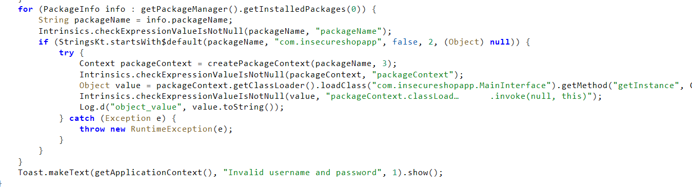
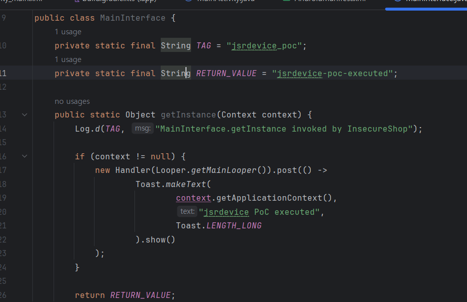
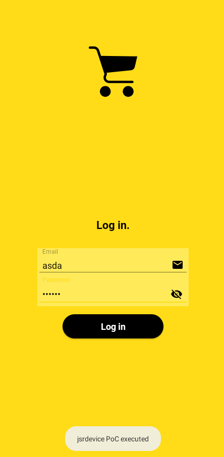
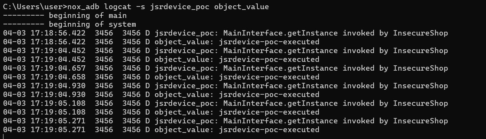

# InsecureShop - Arbitrary Code Execution

## 1. 개요

`InsecureShop`의 `LoginActivity`를 분석한 결과, 설치된 앱 목록 중 패키지명이 `com.insecureshopapp`로 시작하는 앱을 신뢰하고 해당 패키지의 코드를 동적으로 로드하여 실행하는 구조를 확인하였다. 패키지 검증이 prefix 비교 수준에 머물러 있기 때문에, 공격자는 유사한 패키지명을 가진 악성 앱을 설치해 `InsecureShop`가 외부 코드를 실행하도록 유도할 수 있다.

이번 항목은 취약 코드의 정적 분석과, Android Studio로 제작한 별도 PoC 앱을 `Nox`에 설치한 뒤 `logcat`과 `Toast`를 통해 실제 외부 코드가 실행되는지 검증하는 방식으로 진행하였다.

## 2. 취약점 요약

| 항목 | 내용 |
|---|---|
| 취약점명 | `Arbitrary Code Execution via third-party package contexts` |
| 취약점 유형 | 약한 패키지명 검증을 통한 동적 코드 로딩 및 실행 |
| 영향 | 공격자가 설치한 앱의 코드를 `InsecureShop`가 직접 로드 및 실행할 수 있음 |
| 분석 도구 | `jadx`, `Android Studio`, `nox_adb`, `Nox` |
| 핵심 컴포넌트 | `LoginActivity` |

## 3. 분석 환경

| 항목 | 내용 |
|---|---|
| 대상 앱 | `InsecureShop` |
| 실행 환경 | `Nox` |
| 운영체제 | Android |
| 정적 분석 | `jadx` |
| 동적 검증 | `Android Studio`, `nox_adb logcat` |

## 4. 분석 방법

이번 항목은 third-party package context를 통한 코드 실행 여부를 기준으로 다음 순서로 분석하였다.

1. `LoginActivity.onLogin()` 내부에서 외부 패키지를 탐색하는 코드를 확인하였다.
2. 패키지명 검증 방식과 `createPackageContext(...)`, `loadClass(...)`, `invoke(...)` 흐름을 분석하였다.
3. `applicationId`가 `com.insecureshopapp`로 시작하는 PoC 앱을 Android Studio로 제작하였다.
4. PoC 앱 안에 `com.insecureshopapp.MainInterface#getInstance(Context)`를 구현하였다.
5. PoC 앱 설치 후 `InsecureShop` 로그인 버튼 클릭을 트리거로 사용하고, `Toast` 및 `logcat`으로 외부 코드 실행 여부를 검증하였다.

## 5. 상세 분석

### 5.1 LoginActivity의 외부 패키지 탐색

`LoginActivity.onLogin()`을 분석한 결과, 앱은 설치된 패키지 목록을 순회하며 패키지명이 `com.insecureshopapp`로 시작하는 앱을 찾고 있었다.

```java
for (PackageInfo info : getPackageManager().getInstalledPackages(0)) {
    String packageName = info.packageName;
    if (StringsKt.startsWith$default(packageName, "com.insecureshopapp", false, 2, null)) {
        ...
    }
}
```

이 검증은 정확한 패키지 일치 여부가 아니라 prefix 비교만 수행한다. 즉 공격자는 `com.insecureshopapp.jsrdevice`처럼 조건을 만족하는 패키지명을 가진 앱을 자유롭게 설치할 수 있다.

### 5.2 third-party package context 생성과 코드 로딩

조건을 통과한 패키지에 대해서는 `createPackageContext(packageName, 3)`를 호출하여 외부 패키지 context를 생성하고, 그 안에서 특정 클래스를 동적으로 로드하고 있었다.

```java
Context packageContext = createPackageContext(packageName, 3);
Object value = packageContext.getClassLoader()
        .loadClass("com.insecureshopapp.MainInterface")
        .getMethod("getInstance", Context.class)
        .invoke(null, this);
```

여기서 `3`은 `CONTEXT_INCLUDE_CODE`와 `CONTEXT_IGNORE_SECURITY` 조합으로 해석할 수 있으며, 외부 패키지의 코드를 포함한 context를 생성한 뒤 보안 제약을 무시하고 클래스를 로드하는 흐름에 해당한다. 이후 `com.insecureshopapp.MainInterface#getInstance(Context)`가 직접 호출되므로, 조건에 맞는 패키지와 클래스를 가진 앱이 설치되어 있으면 그 코드가 실행된다.

### 5.3 PoC 앱 제작

동적 검증을 위해 Android Studio에서 별도 PoC 앱을 제작하였다.

- `applicationId`: `com.insecureshopapp.jsrdevice`
- 로드 대상 클래스: `com.insecureshopapp.MainInterface`
- 실행 메서드: `getInstance(Context)`

PoC 앱은 실제 악성 행위 대신 아래 세 가지 증적을 남기도록 구현하였다.

- `Toast`: `jsrdevice PoC executed`
- `logcat` 태그: `jsrdevice_poc`
- 반환 문자열: `jsrdevice-poc-executed`

재현에 사용한 APK는 [pocapk/04-Arbitrary Code Execution.apk](../pocapk/04-Arbitrary%20Code%20Execution.apk)에 보관하였다.

### 5.4 동적 검증 결과

PoC 앱 설치 후 `InsecureShop` 로그인 화면에서 임의의 계정정보를 입력하고 로그인 버튼을 클릭하자, 화면 하단에 `jsrdevice PoC executed` 토스트가 표시되었다. 동시에 `logcat`에서는 아래와 같이 PoC 코드가 실제로 호출된 흔적이 확인되었다.

```text
D jsrdevice_poc: MainInterface.getInstance invoked by InsecureShop
D object_value: jsrdevice-poc-executed
```

즉 `InsecureShop`는 사용자가 의도하지 않은 외부 앱의 코드를 실제로 로드 및 실행하고 있었으며, 이 결과 4번 항목은 단순 코드상 가능성이 아니라 동적 검증까지 완료된 취약점으로 확인되었다.

## 6. 영향도

이 구조를 악용하면 공격자는 `com.insecureshopapp`로 시작하는 패키지명을 가진 앱을 피해자 단말기에 설치한 뒤, `InsecureShop` 로그인 동작만으로 자신의 코드를 실행시킬 수 있다. 실제 서비스 환경에서 이와 같은 구조가 존재할 경우 다음과 같은 문제가 발생할 수 있다.

- 사용자가 정상적인 로그인 동작을 수행하는 순간 악성 코드가 함께 실행될 수 있다.
- 외부 패키지의 클래스와 메서드가 앱 내부 trust boundary를 우회해 실행될 수 있다.
- 인증 흐름과 연계된 타이밍에 악성 행위, 데이터 탈취, 후속 행위 트리거가 가능해질 수 있다.

즉 이 취약점은 단순한 패키지 검증 실수가 아니라, 외부 애플리케이션의 코드를 앱 내부 흐름에서 직접 실행하게 만든다는 점에서 매우 위험하다.

## 7. 대응 방안

- 패키지명 검증은 prefix 비교가 아니라 정확한 allowlist 기반으로 수행해야 한다.
- `createPackageContext(..., CONTEXT_INCLUDE_CODE)`와 같은 외부 코드 로딩 구조는 제거하거나 엄격히 제한해야 한다.
- 동적 클래스 로딩이 필요한 경우에도 서명 검증, 패키지 무결성 검증, 신뢰된 배포 채널 검증이 함께 적용되어야 한다.
- 로그인과 같은 민감한 사용자 흐름 내부에서 third-party package code를 실행하지 않도록 설계를 분리해야 한다.

## 8. 결론

이번 분석에서는 `LoginActivity`가 외부 패키지를 약하게 검증한 뒤, 해당 패키지의 클래스를 동적으로 로드하고 메서드를 호출하는 구조를 확인하였다. 또한 별도 PoC 앱을 통해 `Toast`와 `logcat` 증적을 확보함으로써, `Arbitrary Code Execution via third-party package contexts`가 실제로 재현 가능함을 검증하였다.

## 9. 취약점 테스트

### 1. LoginActivity의 third-party package 로딩 코드 확인



`LoginActivity.onLogin()`은 설치된 패키지 목록을 순회하며 패키지명이 `com.insecureshopapp`로 시작하는 앱을 찾고, 조건을 만족하면 `createPackageContext(...)`, `loadClass(...)`, `invoke(...)`를 통해 외부 코드를 실행한다. 이 코드가 4번 취약점의 핵심 근거다.

### 2. PoC 앱의 MainInterface 구현 확인



동적 검증을 위해 `applicationId`가 `com.insecureshopapp.jsrdevice`인 PoC 앱을 제작하고, 그 안에 `com.insecureshopapp.MainInterface#getInstance(Context)`를 구현하였다. 이 메서드는 `Toast`, `logcat`, 반환 문자열을 통해 실행 흔적을 남기도록 구성하였다.

### 3. 로그인 버튼 클릭 시 PoC 코드 실행 확인



`InsecureShop` 로그인 화면에서 임의 자격증명으로 로그인 버튼을 클릭했을 때, 화면 하단에 `jsrdevice PoC executed` 토스트가 표시되었다. 이는 `LoginActivity`가 외부 패키지의 `MainInterface.getInstance(Context)`를 실제로 호출했음을 시각적으로 보여준다.

### 4. logcat 실행 결과 확인



`nox_adb logcat -s jsrdevice_poc object_value` 결과, `MainInterface.getInstance invoked by InsecureShop` 로그와 `object_value: jsrdevice-poc-executed` 반환 값이 반복적으로 출력되었다. 이를 통해 외부 패키지 코드가 실제 실행되었음을 동적으로 검증하였다.
