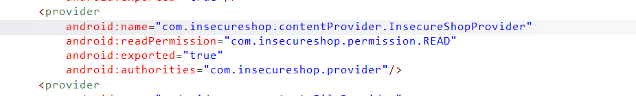
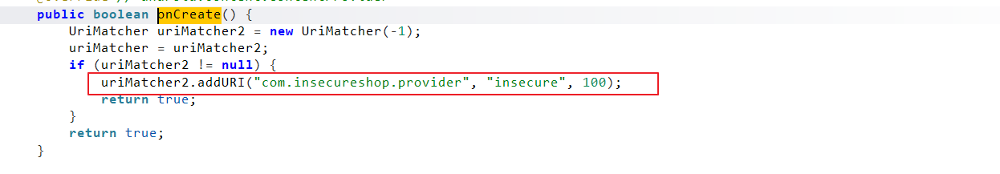
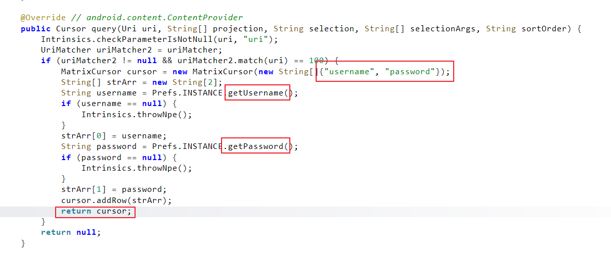
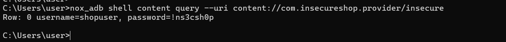

# InsecureShop - Insecure Content Provider

## 1. 개요

`InsecureShop`의 `InsecureShopProvider`를 분석한 결과, 외부에서 직접 query 가능한 ContentProvider를 통해 앱 내부에 저장된 사용자 자격증명이 평문으로 노출되는 것을 확인하였다. 이 Provider는 `content://com.insecureshop.provider/insecure` URI에 대한 요청을 처리하며, `username`과 `password`를 그대로 반환하였다.

이번 항목은 Manifest 선언, URI 매핑 코드, `query()` 구현, 그리고 `content query` 기반 동적 검증을 연결해 실제 자격증명 탈취 가능성을 확인하는 방식으로 진행하였다.

## 2. 취약점 요약

| 항목 | 내용 |
|---|---|
| 취약점명 | `Insecure Content Provider` |
| 취약점 유형 | 민감정보를 직접 반환하는 exported ContentProvider |
| 영향 | 외부에서 앱 내부 사용자명/비밀번호 탈취 가능 |
| 분석 도구 | `jadx`, `nox_adb`, `Nox` |
| 핵심 컴포넌트 | `InsecureShopProvider` |

## 3. 분석 환경

| 항목 | 내용 |
|---|---|
| 대상 앱 | `InsecureShop` |
| 실행 환경 | `Nox` |
| 운영체제 | Android |
| 정적 분석 | `jadx` |
| 동적 검증 | `nox_adb shell content query` |

## 4. 분석 방법

이번 항목은 ContentProvider를 통한 민감정보 노출 여부를 기준으로 다음 순서로 분석하였다.

1. `AndroidManifest.xml`에서 `InsecureShopProvider`의 `exported`, `authorities`, `readPermission` 설정을 확인하였다.
2. `onCreate()`에서 어떤 URI를 처리하는지 `UriMatcher` 등록 코드를 확인하였다.
3. `query()` 메서드가 실제로 어떤 데이터를 반환하는지 분석하였다.
4. `nox_adb shell content query` 명령으로 외부에서 직접 Provider에 접근 가능한지 검증하였다.

## 5. 상세 분석

### 5.1 ContentProvider 노출 설정 확인

Manifest를 확인한 결과 `InsecureShopProvider`는 아래와 같이 선언되어 있었다.

```xml
<provider
    android:name="com.insecureshop.contentProvider.InsecureShopProvider"
    android:readPermission="com.insecureshop.permission.READ"
    android:exported="true"
    android:authorities="com.insecureshop.provider"/>
```

이 선언은 Provider가 외부 요청을 처리할 수 있는 구조이며, 접근 authority가 `com.insecureshop.provider`라는 점을 의미한다. 설정상 `readPermission`이 존재하지만, 실제로 외부 query가 가능한지는 별도 동적 검증이 필요했다.

### 5.2 접근 URI 매핑 확인

`onCreate()`를 분석한 결과 `UriMatcher`는 아래 URI를 처리하도록 등록되어 있었다.

```java
uriMatcher2.addURI("com.insecureshop.provider", "insecure", 100);
```

즉 공격자는 아래 URI로 query를 수행할 수 있다.

```text
content://com.insecureshop.provider/insecure
```

이 단계에서 Provider 접근 경로가 명확해졌고, 이후 `query()`에서 code `100` 요청에 어떤 데이터를 반환하는지 확인하였다.

### 5.3 query()에서 자격증명 반환

`query()` 메서드에서는 `uriMatcher.match(uri) == 100`인 경우 `MatrixCursor`를 생성하고, 그 안에 `username`과 `password` 컬럼을 추가해 값을 반환하고 있었다.

```java
MatrixCursor cursor = new MatrixCursor(new String[]{"username", "password"});
String username = Prefs.INSTANCE.getUsername();
String password = Prefs.INSTANCE.getPassword();
cursor.addRow(strArr);
return cursor;
```

즉 이 Provider는 단순 메타데이터나 공개 정보를 주는 것이 아니라, 앱 내부 `Prefs`에 저장된 실제 사용자명과 비밀번호를 직접 읽어 외부 query 응답으로 전달한다. 이 구조는 민감 정보가 ContentProvider를 통해 직접 노출되는 전형적인 취약 패턴에 해당한다.

### 5.4 외부에서 직접 query 가능한지 검증

정적 분석만으로는 `readPermission`이 실제 접근을 막는지 확정할 수 없었기 때문에, `nox_adb shell content query` 명령으로 직접 접근을 시도하였다.

```powershell
nox_adb shell content query --uri content://com.insecureshop.provider/insecure
```

그 결과 외부 query만으로 아래와 같이 자격증명이 반환되었다.

```text
Row: 0 username=shopuser, password=!ns3csh0p
```

즉 이 Provider는 설정상 보호되는 것처럼 보이더라도, 실제로는 외부에서 직접 접근 가능했고 사용자 자격증명이 평문으로 노출되고 있었다.

## 6. 영향도

이 구조를 악용하면 외부 앱이나 공격자는 별도의 우회 없이 ContentProvider query만으로 사용자 자격증명을 탈취할 수 있다. 실제 서비스 환경에서 이와 같은 구조가 존재할 경우 다음과 같은 문제가 발생할 수 있다.

- 저장된 사용자명과 비밀번호가 외부 앱에 직접 노출될 수 있다.
- 클라이언트 저장소에 보관된 인증 정보가 앱 간 IPC를 통해 쉽게 탈취될 수 있다.
- 탈취된 자격증명은 추가 로그인 시도나 계정 오용으로 이어질 수 있다.

즉 이 취약점은 단순 설정 문제를 넘어, 민감정보를 외부에 노출하는 IPC 경로가 그대로 열려 있다는 점에서 심각하다.

## 7. 대응 방안

- ContentProvider는 민감 정보를 직접 반환하지 않아야 한다.
- 외부 공개가 필요 없는 Provider는 `exported=false`로 설정해야 한다.
- 접근 권한이 필요한 경우에는 실질적으로 동작하는 권한 검증과 호출자 검증을 함께 적용해야 한다.
- 사용자 자격증명과 같은 민감 데이터는 앱 내부 IPC 경로로 외부에 노출되지 않도록 설계해야 한다.

## 8. 결론

이번 분석에서는 `InsecureShopProvider`가 외부에서 직접 query 가능한 상태였고, `username`과 `password`를 그대로 반환함으로써 자격증명 탈취가 가능함을 확인하였다.

즉 `Insecure Content Provider`는 단순 코드상 가능성이 아니라, 실제로 `content query` 한 번만으로 민감 정보가 노출되는 형태로 재현되었다.

## 9. 취약점 테스트

### 1. Provider Manifest 선언 확인



`InsecureShopProvider`는 `android:exported="true"`로 선언되어 있으며, authority는 `com.insecureshop.provider`였다. 이 설정은 ContentProvider가 외부 요청을 받을 수 있음을 보여주며, 이후 실제 접근 가능성을 동적으로 검증할 필요가 있었다.

### 2. 접근 URI 등록 확인



`onCreate()`에서 `UriMatcher`는 `"com.insecureshop.provider", "insecure"` 경로를 code `100`으로 등록하고 있었다. 이를 통해 `content://com.insecureshop.provider/insecure`가 실제 query 대상 URI임을 확인할 수 있다.

### 3. query()의 자격증명 반환 확인



`query()`는 `username`, `password` 컬럼을 가진 `MatrixCursor`를 생성하고, `Prefs.INSTANCE.getUsername()`와 `Prefs.INSTANCE.getPassword()` 값을 그대로 채운 뒤 반환한다. 즉 민감한 로그인 정보가 query 결과로 직접 노출되는 구조다.

### 4. 외부 query 결과 확인



`nox_adb shell content query --uri content://com.insecureshop.provider/insecure` 명령 실행 결과, `shopuser / !ns3csh0p`가 그대로 출력되었다. 이를 통해 외부에서 직접 ContentProvider에 접근하여 저장된 자격증명을 탈취할 수 있음을 검증하였다.
