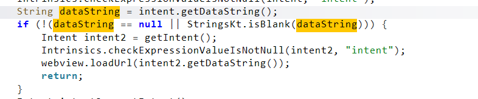
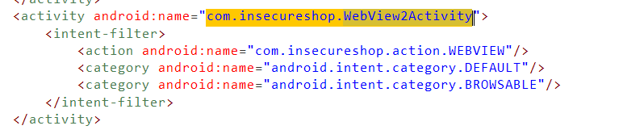
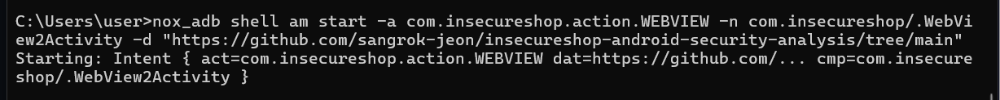
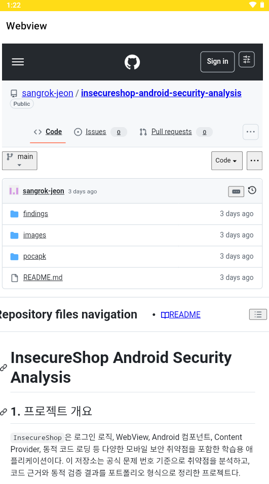

# InsecureShop - Unprotected Data URIs

## 1. 개요

`InsecureShop`의 `WebView2Activity`를 분석한 결과, 외부에서 전달된 `Intent`의 `dataString`을 별도 검증 없이 그대로 `WebView.loadUrl()`에 전달하는 구조를 확인하였다. 이로 인해 외부 앱이나 `adb` 명령을 통해 임의의 URI를 전달하면, 앱 내부 WebView에서 공격자가 원하는 페이지를 직접 로드할 수 있다.

이번 항목은 `AndroidManifest.xml`에서 외부 진입점을 확인한 뒤, `WebView2Activity`의 `Intent data -> loadUrl()` 흐름을 정적 분석하고, `nox_adb shell am start` 명령으로 `https://naver.com`을 전달해 실제 임의 URL 로딩이 가능한지 검증하는 방식으로 진행하였다.

## 2. 취약점 요약

| 항목 | 내용 |
|---|---|
| 취약점명 | `Unprotected Data URIs` |
| 취약점 유형 | 신뢰되지 않은 Data URI를 검증 없이 `WebView.loadUrl()`에 전달 |
| 영향 | 외부에서 전달한 임의 URL을 앱 내부 WebView에 로드 가능 |
| 분석 도구 | `jadx`, `nox_adb`, `Nox` |
| 핵심 컴포넌트 | `WebView2Activity` |

## 3. 분석 환경

| 항목 | 내용 |
|---|---|
| 대상 앱 | `InsecureShop` |
| 실행 환경 | `Nox` |
| 운영체제 | Android |
| 정적 분석 | `jadx` |
| 동적 검증 | `nox_adb shell am start` |

## 4. 분석 방법

이번 항목은 외부 URI가 WebView로 직접 전달되는지 여부를 기준으로 다음 순서로 분석하였다.

1. `AndroidManifest.xml`에서 외부에서 호출 가능한 WebView 관련 Activity를 식별하였다.
2. `WebView2Activity`를 선택해 외부 입력 처리 흐름을 확인하였다.
3. `Intent.getDataString()`으로 전달받은 값이 `loadUrl()`에 직접 전달되는지 분석하였다.
4. `nox_adb shell am start` 명령으로 `https://naver.com`을 `dataString`으로 전달하였다.
5. 앱 내부 WebView에서 `naver.com`이 실제로 로드되는지 확인하였다.

## 5. 상세 분석

### 5.1 WebView2Activity를 선택한 이유

`AndroidManifest.xml`을 확인한 결과 `WebView2Activity`는 아래와 같이 외부 action을 처리하는 Activity로 등록되어 있었다.

```xml
<activity android:name="com.insecureshop.WebView2Activity">
    <intent-filter>
        <action android:name="com.insecureshop.action.WEBVIEW"/>
        <category android:name="android.intent.category.DEFAULT"/>
        <category android:name="android.intent.category.BROWSABLE"/>
    </intent-filter>
</activity>
```

즉 `WebView2Activity`는 외부 앱 또는 `adb` 명령으로 직접 호출 가능한 진입점이며, `WebView`를 포함한 화면을 로드한다는 점에서 우선 분석 대상으로 선택하였다.  
기존 `WebViewActivity`는 `deeplink` 기반 `/web`, `/webview` 분기 검증 이슈와 연결되어 있었지만, 이번 6번은 `Intent data URI` 자체를 보호 없이 사용하는 흐름을 확인하는 것이 목적이므로 `WebView2Activity`가 더 직접적인 분석 대상이었다.

### 5.2 dataString을 그대로 loadUrl()에 전달하는 구조

`WebView2Activity`의 `onCreate()`를 분석한 결과, 외부에서 전달된 `Intent dataString`이 비어 있지 않으면 이를 검증 없이 그대로 `webview.loadUrl()`에 전달하고 있었다.

```java
String dataString = intent.getDataString();
if (!(dataString == null || StringsKt.isBlank(dataString))) {
    Intent intent2 = getIntent();
    webview.loadUrl(intent2.getDataString());
    return;
}
```

이 구조의 문제점은 다음과 같다.

- 입력값이 외부 `Intent`에서 직접 들어온다.
- 허용 도메인 확인, scheme 제한, host 검증 같은 방어 로직이 없다.
- `loadUrl()`에 그대로 전달되므로 임의 사이트가 WebView에 로드될 수 있다.

즉 `WebView2Activity`는 전달받은 URI가 안전한지 판단하지 않고, 외부 입력을 그대로 브라우저 동작으로 연결한다.

### 5.3 추가 입력 경로 존재

동일한 `WebView2Activity` 안에는 `dataString` 외에도 아래와 같은 입력 경로가 추가로 존재했다.

- `intent.getData().getQueryParameter("url")`
- `intent.getExtras().getString("url")`

이들 역시 최종적으로 `webview.loadUrl()`로 이어지지만, 이번 문서에서는 취약 흐름을 가장 단순하고 명확하게 보여주는 `dataString` 분기를 기준으로 재현하였다.

### 5.4 동적 검증

외부에서 `WebView2Activity`를 직접 호출하기 위해 아래 명령을 사용하였다.

```powershell
nox_adb shell am start -a com.insecureshop.action.WEBVIEW -n com.insecureshop/.WebView2Activity -d "https://naver.com"
```

이 명령은 `Intent action`을 `com.insecureshop.action.WEBVIEW`로 지정하고, `dataString` 자리에 `https://naver.com`을 전달한다.  
실행 결과 `WebView2Activity`가 열리며 앱 내부 WebView에서 `https://www.naver.com/` 페이지가 실제로 로드되는 것을 확인하였다.

즉 외부에서 전달한 Data URI가 아무 보호 없이 앱 내부 WebView에 그대로 반영되었고, 이를 통해 `Unprotected Data URIs` 취약점이 동적으로 재현되었다.

## 6. 영향도

이 구조를 악용하면 공격자는 외부 앱, `adb`, 또는 다른 IPC 경로를 통해 임의 URL을 `WebView2Activity`에 전달하고 앱 내부 WebView에서 이를 로드하게 만들 수 있다. 실제 서비스 환경에서 이와 같은 구조가 존재할 경우 다음과 같은 문제가 발생할 수 있다.

- 사용자가 앱 내부의 정상 화면으로 오인한 상태에서 피싱 페이지를 볼 수 있다.
- 외부에서 지정한 임의 사이트가 앱의 WebView 신뢰 영역 안에서 열릴 수 있다.
- 다른 WebView 보안 설정 문제와 결합될 경우 추가 공격으로 이어질 수 있다.

즉 이 취약점은 단순한 링크 오픈 문제가 아니라, 외부 입력이 앱 내부 브라우징 동작을 직접 제어할 수 있게 만든다는 점에서 위험하다.

## 7. 대응 방안

- 외부에서 전달된 `dataString`, query parameter, extra 값을 `loadUrl()`에 직접 전달하지 않아야 한다.
- 허용할 URI scheme과 host를 명확히 제한하고 allowlist 기반으로 검증해야 한다.
- 외부 action으로 호출 가능한 Activity에서는 `WebView` 로딩 기능을 최소화하거나 내부 전용 흐름과 분리해야 한다.
- 임의 URL 로딩이 불가피한 경우에도 URL 정규화, host 검증, 허용 도메인 제한을 함께 적용해야 한다.

## 8. 결론

이번 분석에서는 `WebView2Activity`가 외부에서 전달된 `Intent dataString`을 보호 없이 `WebView.loadUrl()`에 전달하는 구조를 확인하였다. 또한 `nox_adb shell am start` 명령으로 `https://naver.com`을 전달한 결과, 앱 내부 WebView에서 해당 페이지가 실제로 로드되는 것을 확인함으로써 `Unprotected Data URIs` 취약점이 재현 가능함을 검증하였다.

## 9. 취약점 테스트

### 1. WebView2Activity 외부 진입점 확인



`WebView2Activity`는 `com.insecureshop.action.WEBVIEW` action을 처리하도록 등록되어 있으며, `DEFAULT`, `BROWSABLE` category를 함께 사용한다. 이 설정을 통해 외부에서 해당 Activity를 직접 호출할 수 있음을 확인하였다.

### 2. dataString -> loadUrl() 흐름 확인



`Intent.getDataString()` 값이 비어 있지 않으면 별도 검증 없이 바로 `webview.loadUrl(intent2.getDataString())`가 실행된다. 이 코드가 6번 취약점의 핵심 근거다.

### 3. adb로 임의 Data URI 전달



`nox_adb shell am start` 명령으로 `https://naver.com`을 `WebView2Activity`의 `dataString`으로 전달하였다. 출력 결과에서도 `dat=https://naver.com` 형태로 Data URI가 Activity에 전달되는 것을 확인할 수 있다.

### 4. WebView에서 임의 URL 로드 확인



명령 실행 후 `WebView2Activity`가 열리며 앱 내부 WebView에서 `https://www.naver.com/` 페이지가 실제로 로드되었다. 이를 통해 외부에서 전달한 Data URI가 검증 없이 그대로 사용되고 있음을 동적으로 확인하였다.
