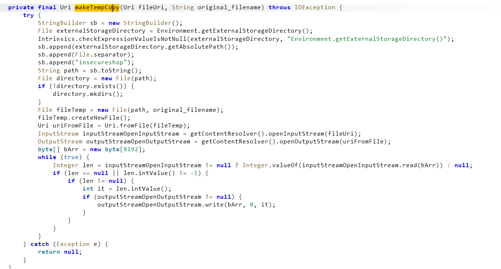
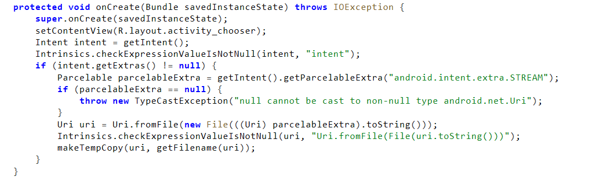
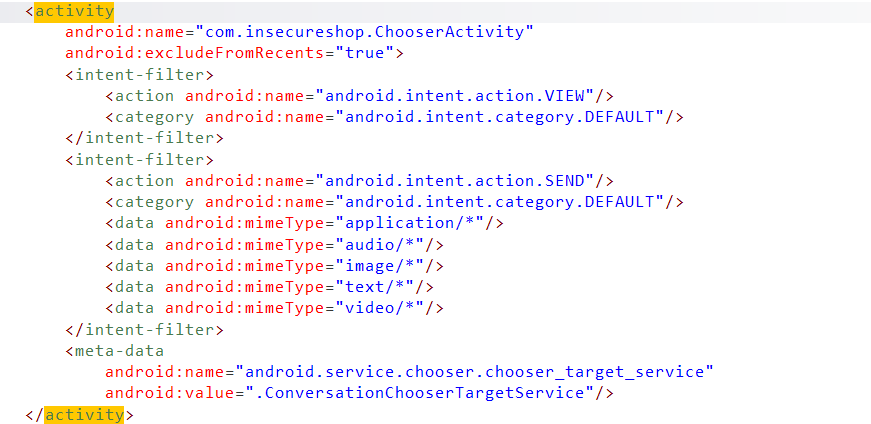
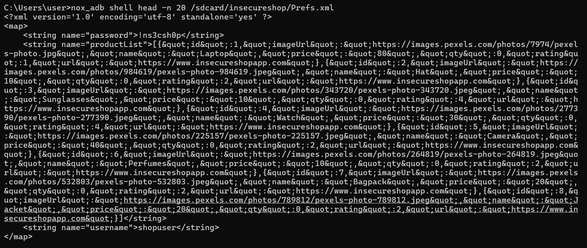

# InsecureShop - Theft of Arbitrary Files

## 1. 개요

`InsecureShop`의 `ChooserActivity`를 분석한 결과, 외부에서 전달된 `android.intent.extra.STREAM` 값을 검증 없이 로컬 파일처럼 처리한 뒤, 해당 파일 내용을 외부 저장소(`/sdcard/insecureshop/`)로 복사하는 구조를 확인하였다. 이로 인해 공격자는 `SEND` Intent를 이용해 앱 내부 저장소에 있는 임의 파일 경로를 전달하고, 앱이 가진 권한으로 해당 파일을 읽어 외부 저장소로 유출시키도록 만들 수 있다.

이번 항목은 먼저 `AndroidManifest.xml`에서 `ChooserActivity`가 외부 `SEND` 요청을 받을 수 있는 진입점인지 확인하고, 이후 `onCreate()`와 `makeTempCopy()` 코드를 통해 외부 URI가 실제 파일 복사 흐름으로 이어지는지 분석하였다. 마지막으로 `nox_adb shell am start` 명령으로 `Prefs.xml` 경로를 `EXTRA_STREAM`에 넣어 전달하고, `/sdcard/insecureshop/Prefs.xml` 파일이 생성되며 실제 설정값과 자격증명이 복사되는지 동적으로 검증하였다.

## 2. 취약점 요약

| 항목 | 내용 |
|---|---|
| 취약점명 | `Theft of Arbitrary Files` |
| 취약점 유형 | 외부에서 전달된 파일 경로를 신뢰하고 앱 내부 파일을 외부 저장소로 복사 |
| 영향 | 앱 로컬 저장소의 임의 파일이 외부 저장소로 유출될 수 있음 |
| 분석 도구 | `jadx`, `nox_adb`, `Nox` |
| 핵심 컴포넌트 | `ChooserActivity` |

## 3. 분석 환경

| 항목 | 내용 |
|---|---|
| 대상 앱 | `InsecureShop` |
| 실행 환경 | `Nox` |
| 운영체제 | Android |
| 정적 분석 | `jadx` |
| 동적 검증 | `nox_adb shell am start`, `nox_adb shell head` |

## 4. 분석 방법

이번 항목은 외부에서 전달한 파일 경로가 앱 내부 파일 복사로 이어지는지 여부를 기준으로 다음 순서로 분석하였다.

1. `AndroidManifest.xml`에서 `ChooserActivity`가 외부 `SEND` Intent를 처리할 수 있는지 확인하였다.
2. `ChooserActivity.onCreate()`에서 `android.intent.extra.STREAM` 값을 어떻게 처리하는지 분석하였다.
3. `makeTempCopy()`가 입력 파일을 어디로 복사하는지 확인하였다.
4. `Prefs.xml` 경로를 `EXTRA_STREAM`에 넣어 `ChooserActivity`를 호출하였다.
5. `/sdcard/insecureshop/Prefs.xml` 파일이 생성되는지 확인하고, 그 안에 실제 `username`, `password` 값이 복사되었는지 검증하였다.

## 5. 상세 분석

### 5.1 왜 ChooserActivity를 먼저 봤는가

`AndroidManifest.xml`을 확인한 결과 `ChooserActivity`는 아래와 같이 `VIEW`와 `SEND` 요청을 처리하는 Activity로 등록되어 있었다.

```xml
<activity
    android:name="com.insecureshop.ChooserActivity"
    android:excludeFromRecents="true">
    <intent-filter>
        <action android:name="android.intent.action.VIEW"/>
        <category android:name="android.intent.category.DEFAULT"/>
    </intent-filter>
    <intent-filter>
        <action android:name="android.intent.action.SEND"/>
        <category android:name="android.intent.category.DEFAULT"/>
        <data android:mimeType="application/*"/>
        <data android:mimeType="audio/*"/>
        <data android:mimeType="image/*"/>
        <data android:mimeType="text/*"/>
        <data android:mimeType="video/*"/>
    </intent-filter>
</activity>
```

즉 `ChooserActivity`는 외부 앱이나 `adb` 명령을 통해 직접 호출 가능하며, 특히 다양한 MIME 타입의 공유 요청을 받을 수 있다. 파일 탈취 문제를 찾을 때는 보통 “외부에서 파일이나 URI를 넣을 수 있는 Activity”를 먼저 찾아야 하므로, `ChooserActivity`는 7번 항목의 가장 유력한 진입점으로 판단하였다.

### 5.2 EXTRA_STREAM을 검증 없이 파일처럼 처리하는 구조

`ChooserActivity`의 `onCreate()`를 분석한 결과, 외부에서 전달된 `android.intent.extra.STREAM` 값을 그대로 `Uri`로 받아 로컬 파일처럼 변환한 뒤 `makeTempCopy()`로 넘기고 있었다.

```java
Parcelable parcelableExtra = getIntent().getParcelableExtra("android.intent.extra.STREAM");
if (parcelableExtra == null) {
    throw new TypeCastException("null cannot be cast to non-null type android.net.Uri");
}
Uri uri = Uri.fromFile(new File(((Uri) parcelableExtra).toString()));
makeTempCopy(uri, getFilename(uri));
```

이 흐름에서 중요한 점은 다음과 같다.

- 입력값은 외부 `Intent`의 `EXTRA_STREAM`에서 직접 들어온다.
- 파일 경로나 URI가 안전한지 검증하는 로직이 없다.
- 수신한 값을 곧바로 `File`과 `Uri`로 바꿔 로컬 파일처럼 취급한다.
- 이후 `makeTempCopy()`로 전달되므로 실제 파일 복사 흐름이 시작된다.

즉 이 Activity는 “외부에서 전달된 파일 위치 정보”를 신뢰하고, 이를 내부 파일 처리 로직으로 바로 연결한다.

### 5.3 makeTempCopy()가 실제로 하는 일

`makeTempCopy()`는 전달받은 파일을 외부 저장소로 복사하는 역할을 한다.

```java
File externalStorageDirectory = Environment.getExternalStorageDirectory();
...
sb.append("insecureshop");
String path = sb.toString();
File fileTemp = new File(path, original_filename);
...
InputStream inputStreamOpenInputStream = getContentResolver().openInputStream(fileUri);
OutputStream outputStreamOpenOutputStream = getContentResolver().openOutputStream(uriFromFile);
...
outputStreamOpenOutputStream.write(bArr, 0, it);
```

코드 흐름을 순서대로 보면 다음과 같다.

1. 외부 저장소 루트(`/sdcard`)를 가져온다.
2. 그 아래 `insecureshop` 폴더를 만든다.
3. 복사본 파일 이름을 만든다.
4. 입력 스트림으로 원본 파일을 읽는다.
5. 출력 스트림으로 `/sdcard/insecureshop/<파일명>`에 쓴다.

즉 앱은 외부에서 지정된 파일을 “자기 권한으로 읽은 뒤”, 외부 저장소에 복사본을 남기고 있다. 이 구조 때문에 원래 외부 앱이 직접 접근할 수 없는 앱 내부 파일도, `ChooserActivity`를 통해 외부 저장소로 유출될 수 있다.

### 5.4 왜 Prefs.xml을 대상으로 검증했는가

동적 검증에는 아래 파일을 사용하였다.

```text
/data/data/com.insecureshop/shared_prefs/Prefs.xml
```

이 파일은 앱의 로컬 저장소(shared preferences)에 위치하며, 이전 분석 항목들에서도 사용자 자격증명과 설정값을 담고 있는 핵심 파일로 확인되었다. 따라서 `Prefs.xml`이 실제로 외부 저장소로 복사된다면, 7번 취약점이 단순 파일 복사가 아니라 민감 정보 탈취까지 이어질 수 있음을 명확하게 보여줄 수 있다.

### 5.5 동적 검증

`ChooserActivity`를 직접 호출하기 위해 아래 명령을 사용하였다.

```powershell
nox_adb shell am start -a android.intent.action.SEND -t text/xml -n com.insecureshop/.ChooserActivity --eu android.intent.extra.STREAM "/data/data/com.insecureshop/shared_prefs/Prefs.xml"
```

이 명령은 `SEND` Intent로 `ChooserActivity`를 실행하면서, `android.intent.extra.STREAM` 값에 앱 내부 파일 경로를 전달한다.  
실행 후 `/sdcard/insecureshop/Prefs.xml` 파일이 생성되었고, 파일 크기는 `2478` 바이트로 확인되었다.

이후 아래 명령으로 복사본 내용을 확인하였다.

```powershell
nox_adb shell head -n 20 /sdcard/insecureshop/Prefs.xml
```

출력 결과에는 다음과 같은 민감 정보가 실제로 포함되어 있었다.

- `<string name="password">!ns3csh0p</string>`
- `<string name="username">shopuser</string>`

즉 공격자는 `ChooserActivity`를 통해 앱 로컬 저장소에 있는 `Prefs.xml` 파일을 외부 저장소로 복사시키고, 그 안에 포함된 자격증명까지 획득할 수 있었다.

## 6. 영향도

이 구조를 악용하면 공격자는 외부 앱 또는 `adb`를 통해 `ChooserActivity`에 임의의 내부 파일 경로를 전달하고, 앱 권한으로 해당 파일을 읽어 외부 저장소에 복사하게 만들 수 있다. 실제 서비스 환경에서 이와 같은 구조가 존재할 경우 다음과 같은 문제가 발생할 수 있다.

- 앱 sandbox 내부에 저장된 설정 파일이나 민감 데이터 파일이 외부 저장소로 유출될 수 있다.
- 자격증명, 세션 정보, 사용자 설정값 등 로컬 저장 데이터가 직접 탈취될 수 있다.
- 외부 저장소에 생성된 복사본은 다른 앱이나 사용자에 의해 추가 접근될 수 있다.

즉 이 취약점은 단순한 파일 처리 실수가 아니라, 앱 로컬 저장소 경계를 우회해 내부 파일을 밖으로 빼낼 수 있게 만든다는 점에서 위험하다.

## 7. 대응 방안

- 외부에서 전달된 `EXTRA_STREAM` 값을 신뢰하지 말고, 허용된 URI scheme과 경로만 처리해야 한다.
- 앱 내부 파일 경로(`/data/data/...`)를 외부 입력으로 받아 복사하는 구조를 제거해야 한다.
- 공유 기능이 필요한 경우에도 `FileProvider`나 명시적 allowlist 기반 URI 검증을 적용해야 한다.
- 민감한 로컬 파일을 외부 저장소로 복사하는 동작은 금지하거나, 최소한 엄격한 권한 검증과 파일 경로 검증을 함께 적용해야 한다.

## 8. 결론

이번 분석에서는 `ChooserActivity`가 외부에서 전달된 `android.intent.extra.STREAM` 값을 검증 없이 파일처럼 처리하고, `makeTempCopy()`를 통해 앱 내부 파일을 외부 저장소로 복사하는 구조를 확인하였다. 또한 `Prefs.xml` 파일 경로를 전달한 결과 `/sdcard/insecureshop/Prefs.xml` 복사본이 생성되었고, 그 안에서 `username`과 `password` 값이 실제로 확인됨으로써 `Theft of Arbitrary Files` 취약점이 재현 가능함을 검증하였다.

## 9. 취약점 테스트

### 1. ChooserActivity 외부 진입점 확인



`ChooserActivity`는 `VIEW`, `SEND` intent-filter를 통해 외부 요청을 받을 수 있으며, `application/*`, `audio/*`, `image/*`, `text/*`, `video/*` 등 다양한 MIME 타입을 처리하도록 등록되어 있다. 이 설정을 통해 `ChooserActivity`가 파일/공유 관련 취약점의 외부 진입점임을 확인하였다.

### 2. EXTRA_STREAM 수신 후 makeTempCopy() 호출 확인



`ChooserActivity.onCreate()`는 `android.intent.extra.STREAM` 값을 `Parcelable` 형태로 수신한 뒤, 이를 `Uri`로 처리하여 `makeTempCopy(uri, getFilename(uri))`로 전달한다. 즉 외부 입력이 검증 없이 바로 파일 복사 흐름으로 이어지는 구조다.

### 3. makeTempCopy()의 외부 저장소 복사 로직 확인



`makeTempCopy()`는 입력 파일을 `InputStream`으로 읽고, `/sdcard/insecureshop/` 아래에 생성한 파일로 그대로 기록한다. 이 코드는 앱 내부 파일이 외부 저장소 복사본으로 유출되는 핵심 근거다.

### 4. Prefs.xml 실제 유출 확인



`nox_adb shell head -n 20 /sdcard/insecureshop/Prefs.xml` 결과, 복사본 파일 안에서 `password=!ns3csh0p`와 `username=shopuser` 값이 실제로 확인되었다. 이를 통해 `ChooserActivity`를 이용한 앱 로컬 저장소 파일 탈취가 성공적으로 재현되었음을 검증하였다.
